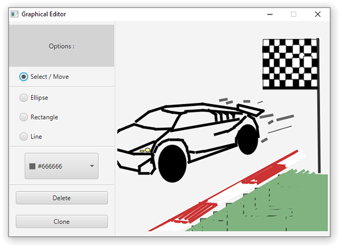

Interaction Homme-Machine @ Et3
 
Polytech Paris-Saclay | 2019-20

---

# tp-note-IHM-AntoninD
HMI - Polytech ET3 IT - Noted practical for S6

## Objectives / Asked work

[Subject link](./IHM_Polytech_Programmation_des_Interfaces_Interactives_Avancees_1.pdf)

## Getting Started

These instructions will get you a copy of the project up and running on your local machine for development purpose.

### Prerequisites

Things you need to install the project :

- [Java 8 SE](https://www.java.com/fr/download/)

If you use a later JDK, be careful because JavaFX is decoupled from the JDK since the JDK 11.
You have to download it separately [here](https://gluonhq.com/products/javafx/).

### Installing

Here are some instructions on how to get the development env running.

First, clone this repository with the following command :
`git clone https://github.com/adepreis/tp-note-IHM-AntoninD`

Then create the Java project from `/src` folder using your favorite IDE.

### Run the latest version

Execute the .jar file from the last [release assets](https://github.com/adepreis/tp-note-IHM-AntoninD/releases/tag/0.0.1) with the following command :

`java -jar tp-note-IHM-AntoninD.jar`